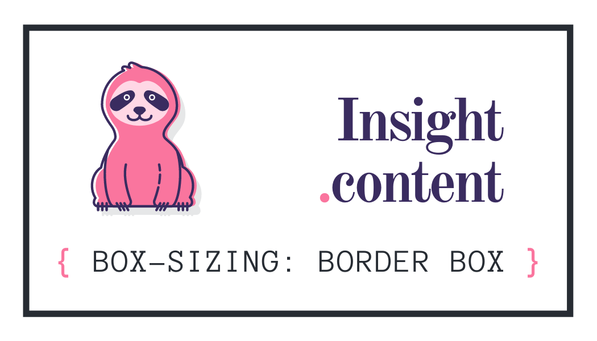

✅<a href="https://andreadcsousa.github.io/alura_webpage_flexbox/"> Veja a Página </a>✅<a href="https://github.com/andreadcsousa"> Meu Perfil </a>✅<a href="https://andreadcsousa.github.io/"> Projetos </a>

# Sobre o Curso/Projeto

A partir do curso `Flexbox: Posicione elementos na tela`, aprendi a fazer a página da [Alurinha](https://cursos.alura.com.br/course/posicione-elementos-com-flexbox).

- Aprenda a famosa especificação flexible box para posicionar seus elementos na página;
- Entenda as diversas propriedades do flexbox e como usá-las;
- Entenda como as propriedades do flexbox substituem float, inline e inline-block;
- Elabore um site responsivo com flexbox.

# Linguagens Utilizadas

## Alurinha

Aplicando FLEXBOX em uma página web.

